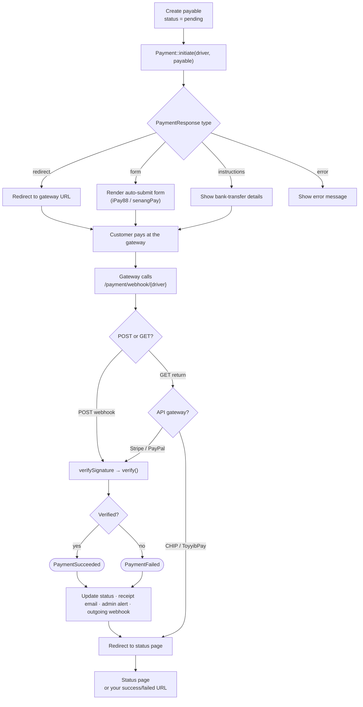

# Malaysia Payment Gateway

A Laravel package for payment gateway integrations. Supports Malaysian gateways (CHIP, ToyyibPay) plus international gateways (Stripe, PayPal) and a manual proof flow.

## Features

✅ **Multiple Gateways** - CHIP, ToyyibPay, Stripe, PayPal, Manual Proof  
✅ **Unified API** - Same interface for all gateways  
✅ **Unified Callback Routes** - Built-in handling for gateway POST callbacks and GET returns  
✅ **Return URL Handling** - Unified callback for both webhooks and user returns  
✅ **Status Portal** - Customer-facing payment tracking based on stored payment state  
✅ **Email Notifications** - Automatic payment receipts  
✅ **Custom Payable Models** - Use the built-in `Payment` model or your own model
✅ **Developer Sandbox** - Test gateways without writing code

> **Current state:** this package is published on Packagist as `ejoi8/malaysia-payment-gateway`, with source hosted at `https://github.com/ejoi8/malaysia-payment-gateway`. Webhook signature verification is implemented for all four automated gateways and is **active once you configure the relevant secret/key** (CHIP `public_key`, ToyyibPay is automatic, Stripe `webhook_secret`, PayPal `webhook_id`); when unconfigured it is skipped and logged. Live `checkStatus()` polling is implemented for all four gateways and exposed via the `payment:reconcile` command — see [Reconciliation](#reconciliation--recovering-missed-webhooks).

---

## Quick Start

### 1. Installation

```bash
composer require ejoi8/malaysia-payment-gateway
php artisan migrate
```

Package links:

- Packagist: `https://packagist.org/packages/ejoi8/malaysia-payment-gateway`
- GitHub: `https://github.com/ejoi8/malaysia-payment-gateway`

### 2. Configure `.env`

```env
# Default Gateway
PAYMENT_GATEWAY_DEFAULT=chip

# CHIP (Malaysian FPX)
CHIP_BRAND_ID=your-brand-id
CHIP_SECRET_KEY=your-secret-key
CHIP_SANDBOX=true

# ToyyibPay (Malaysian FPX)
TOYYIBPAY_SECRET_KEY=your-secret-key
TOYYIBPAY_CATEGORY_CODE=your-category-code
TOYYIBPAY_SANDBOX=true

# Stripe
STRIPE_PUBLIC_KEY=pk_test_xxx
STRIPE_SECRET_KEY=sk_test_xxx
STRIPE_WEBHOOK_SECRET=whsec_xxx

# PayPal
PAYPAL_CLIENT_ID=your-client-id
PAYPAL_CLIENT_SECRET=your-client-secret
PAYPAL_SANDBOX=true

# Currency Configuration (optional - defaults to MYR)
PAYMENT_DEFAULT_CURRENCY=MYR
CHIP_CURRENCY=MYR
STRIPE_CURRENCY=MYR
PAYPAL_CURRENCY=MYR

# Notifications / sandbox helpers
PAYMENT_NOTIFICATIONS_ENABLED=true
PAYMENT_NOTIFICATIONS_QUEUE=false
PAYMENT_GATEWAY_SANDBOX=false

# Manual proof (optional)
MANUAL_PROOF_MESSAGE="Please transfer and send your receipt"
MANUAL_PROOF_BANK_INFO="Maybank 1234567890"
```

> **Note:** ToyyibPay is MYR-only. Other gateways can be configured to use different currencies.

### 3. Create a Payment

```php
use Ejoi8\MalaysiaPaymentGateway\Models\Payment;
use Ejoi8\MalaysiaPaymentGateway\GatewayManager;

class CheckoutController extends Controller
{
    public function store(Request $request, GatewayManager $gateway)
    {
        // 1. Create payment record
        $payment = Payment::create([
            'gateway' => 'chip',
            'reference' => 'ORD-' . uniqid(),
            'amount' => 5000, // RM 50.00 (in cents)
            'currency' => 'MYR',
            'description' => 'Court Booking',
            'customer_name' => 'Ali',
            'customer_email' => 'ali@example.com',
            'items' => [
                ['name' => 'Badminton Court', 'quantity' => 1, 'price' => 5000]
            ],
        ]);

        // 2. Initiate payment
        $response = $gateway->initiate('chip', $payment);

        // 3. Redirect to gateway (typed API; array access also works)
        if ($response->isRedirect()) {
            return redirect($response->redirectUrl());
        }

        return back()->with('error', $response->errorMessage() ?? 'Payment failed');
    }
}
```

Prefer the facade? It reads the same and needs no constructor injection:

```php
use Ejoi8\MalaysiaPaymentGateway\Facades\Payment;

$response = Payment::initiate('chip', $payment);
// or resolve a single driver: Payment::gateway('chip')->initiate($payment);
```

**That's it!** The package handles everything else automatically.

---

## How It Works



**Three gateway styles, one flow.** *Webhook* gateways (CHIP, ToyyibPay) are verified by the POST callback — the GET return just shows status. *API* gateways (Stripe, PayPal) are verified on both the POST webhook and the GET return. *Manual* (bank transfer) is approved by you. Everything after `initiate()` — verification, status updates, emails, and your outgoing webhook — runs automatically.

---

## Usage

### 1. Create the payment

```php
use Ejoi8\MalaysiaPaymentGateway\Models\Payment;

$payment = Payment::create([
    'gateway' => 'chip',
    'reference' => 'ORD-'.uniqid(),
    'amount' => 5000,            // cents → RM 50.00
    'currency' => 'MYR',
    'description' => 'Court Booking',
    'customer_name' => 'Ali',
    'customer_email' => 'ali@example.com',
    'items' => [['name' => 'Badminton Court', 'quantity' => 1, 'price' => 5000]],
]);
```

`Payment` is the built-in model; plug in [your own model](#using-your-own-model) just as easily.

### 2. Initiate and hand off to the gateway

`initiate()` returns a `PaymentResponse`. Branch on its type — every gateway style is covered:

```php
use Ejoi8\MalaysiaPaymentGateway\Facades\Payment;

$r = Payment::initiate($payment->gateway, $payment);

return match (true) {
    $r->isRedirect()     => redirect($r->redirectUrl()),                 // CHIP, ToyyibPay, Stripe, PayPal
    $r->isFormPost()     => view('payment-gateway::auto-submit', [       // iPay88, senangPay
        'action' => $r->formAction(),
        'fields' => $r->formFields(),
    ]),
    $r->isInstructions() => view('checkout.manual', ['details' => $r]),  // bank transfer
    default              => back()->with('error', $r->errorMessage()),   // initiation failed
};
```

Array access still works (`$r['url']`, `$r['session_id']`) if you prefer.

### 3. The callback — handled for you

One route, `/payment/webhook/{driver}`, accepts both the server-to-server **POST** webhook and the customer **GET** return. It verifies the signature, verifies the payment, updates the record, and fires events. **You write nothing here** — just point each gateway's callback/return URL at it (see [Webhook Setup](#webhook-setup)).

### 4. React to the outcome (optional)

Hook your domain logic onto the events:

```php
use Ejoi8\MalaysiaPaymentGateway\Events\PaymentSucceeded;

Event::listen(PaymentSucceeded::class, function (PaymentSucceeded $e) {
    Booking::where('reference', $e->payable->getPaymentReference())->update(['confirmed' => true]);
});
```

Built in already: customer receipt email, optional admin alert, and an optional signed [outgoing webhook](#notifications) to your own backend.

### 5. Where the customer lands after paying

By default, once the package verifies the payment on the customer's return, it
sends them to the **built-in status page** — a styled card showing PAID / FAILED
/ PENDING (publishable via `vendor:publish --tag=payment-gateway-views`):

```
/payment/status/{reference}   # styled status page (default)
/payment/check-status         # "track my payment" search portal
```

**Prefer your own pages?** Set redirect URLs — applied *after* verification, so
Stripe/PayPal still get verified first:

```php
// config/payment-gateway.php
'redirects' => [
    'success' => env('PAYMENT_SUCCESS_URL', '/checkout/thank-you'),
    'failed'  => env('PAYMENT_FAILED_URL',  '/checkout/failed'),
],
```

```
pay → https://yourapp.com/checkout/thank-you?reference=ORD-1024
```

- The reference is appended as `?reference=…`, or substituted into a
  `{reference}` placeholder (`/booking/{reference}/confirmed`).
- **Per-payment override** (different flows in one app) — set it when creating
  the payment; it wins over the global config:

  ```php
  Payment::create([
      // ...
      'metadata' => ['urls' => [
          'success_redirect' => route('booking.confirmed', $booking),
          'failed_redirect'  => route('booking.retry', $booking),
      ]],
  ]);
  ```
- Unset → falls back to the built-in status page. On your page, look up the
  **real** status server-side via the reference (never trust a query param).

### 6. Refund (Stripe, PayPal, CHIP)

```php
$result = Payment::refund('stripe', $payment->transaction_id, 5000); // omit amount = full refund

if ($result->success) {
    // payable is automatically marked 'refunded'
}
```

---

## Gateway Types

### Webhook-Based Gateways (CHIP, ToyyibPay)

These gateways send payment verification via **POST webhook**. The user return (GET) just redirects to the status page.

```
POST /payment/webhook/chip    → Verify payment, update status
GET  /payment/webhook/chip    → Redirect to status page
```

### API-Based Gateways (Stripe, PayPal)

These gateways require an **API call** to verify payment. Verification can happen on both POST webhook and GET return.

```
POST /payment/webhook/stripe  → Verify via webhook payload
GET  /payment/webhook/stripe  → Verify via session_id API call
```

### Normalized `initiate()` / `verify()` Responses

`initiate()` returns a `PaymentResponse` and `verify()`/`refund()` return a
`VerificationResult`. Both are immutable value objects that expose typed
accessors **and** implement `ArrayAccess`, so the v1 array style keeps working
unchanged while new code gets type safety and IDE autocomplete.

```php
$response = Payment::initiate('chip', $payment);

// New, typed API
$response->isRedirect();      // bool
$response->redirectUrl();     // ?string
$response->transactionId;     // ?string
$response->errorMessage();    // ?string when it failed

// Backward-compatible array access (unchanged from v1)
$response['type'];            // 'redirect' | 'instructions' | 'error'
$response['url'];
$response['transaction_id'];
$response['session_id'];      // gateway-specific extras still resolve
```

`PaymentResponse` guarantees:

- `type` is always present (`redirect`, `instructions` or `error`)
- `payload` is always present (the request payload sent to the gateway)
- `transaction_id` is present on success and `null` on initiation errors
- `url` / `response` are present for redirect-based gateways
- gateway-specific keys are preserved: Stripe `session_id`, PayPal `order_id`,
  Manual Proof top-level instruction fields (`message`, `bank_info`, `amount`, …)

`VerificationResult` exposes `->success`, `->transactionId`, `->error`, `->meta`
(and the same keys via array access).

Built-in `transaction_id` mappings:

- CHIP: response `id`
- Stripe: Checkout Session `id`
- PayPal: Order `id`
- ToyyibPay: `BillCode`
- Manual Proof: `manual-{reference}`

### Initiation response types

A gateway hands off to the customer in one of several ways. `PaymentResponse`
models each so the package can support many gateway styles, not just redirects:

| `type`         | Builder (`AbstractGateway`)            | Used by | Front-end handling |
| -------------- | -------------------------------------- | ------- | ------------------ |
| `redirect`     | `$this->redirect($url, …)`             | CHIP, ToyyibPay, Stripe, PayPal | `redirect($r->redirectUrl())` |
| `form`         | `$this->form($action, $fields, …)`     | iPay88, senangPay (signed form POST) | `return view('payment-gateway::auto-submit', [...])` |
| `client_token` | `$this->clientToken($token, …)`        | Midtrans Snap, Razorpay (JS SDK) | pass `$r->token()` to the front-end SDK |
| `instructions` | `$this->instructions($fields, …)`      | Manual Proof | show bank details |
| `error`        | `$this->fail($message, …)`             | any (initiation failed) | show `$r->errorMessage()` |

The bundled `payment-gateway::auto-submit` Blade view renders a `form`-type
response as an auto-submitting POST:

```php
$response = Payment::initiate('ipay88', $payment);

if ($response->isFormPost()) {
    return view('payment-gateway::auto-submit', [
        'action' => $response->formAction(),
        'fields' => $response->formFields(),
        'method' => $response->formMethod(),
    ]);
}
```

> **Amounts are always in the smallest currency unit (cents).** `getPaymentAmount()`
> and item `price` are integers (e.g. `5500` = RM 55.00). Gateways that need a
> decimal string (PayPal) convert with `Support\Money::toDecimal()`; gateways that
> want cents (CHIP, ToyyibPay, Stripe) send the value as-is.

### How line items reach the gateway

Your full itemised `items` array is stored on the payment record and shown on
**your** pages — but the gateway is always charged a **single line at the
payable's total `amount`**. This makes `amount` the one source of truth: Stripe
can't recompute a different total, PayPal can't reject a mismatched breakdown,
and there's no provider line-item limit to hit.

The single line is named after `getPaymentDescription()`, with an automatic
`(N items)` suffix when the cart holds more than one unit — so the gateway
receipt still signals a multi-item purchase:

```
Cart: T-Shirt + Shoes + Cap   →   gateway shows:  "Order ORD-1024 (3 items)  RM200.00"
```

Tune the suffix via `gateway_line.append_count` / `gateway_line.label` (e.g.
`(3 tickets)`), or set the count yourself in the description and turn the suffix
off. Itemisation for the customer lives on your own checkout/receipt pages.

---

## Supported Gateways

| Gateway          | Type    | Return URL | Refund | Signature verification |
| ---------------- | ------- | ---------- | ------ | ---------------------- |
| **CHIP**         | Webhook | ✅         | ✅ | RSA-SHA256 — set `public_key` |
| **ToyyibPay**    | Webhook | ✅         | ❌ (no API) | `md5` hash — automatic |
| **Stripe**       | API     | ✅         | ✅ | HMAC-SHA256 — set `webhook_secret` |
| **PayPal**       | API     | ✅         | ✅ | Verify API — set `webhook_id` |
| **Manual Proof** | Manual  | ❌         | Manual only | n/a |

Each gateway's `verifySignature()` verifies the callback when its key/secret is configured, and **skips with a logged warning** when it isn't (so local development isn't blocked). Configure the secret in production. The customer status page shows the package's stored payment status, kept current by webhooks and the [reconcile command](#reconciliation--recovering-missed-webhooks).

---

## Configuration

### Publish Config

```bash
php artisan vendor:publish --tag=payment-gateway-config
```

### Key Configuration Options

```php
// config/payment-gateway.php

return [
    // Default gateway
    'default' => env('PAYMENT_GATEWAY_DEFAULT', 'chip'),

    // Your Payable model (use built-in or your own)
    'model' => \Ejoi8\MalaysiaPaymentGateway\Models\Payment::class,

    // Save the gateway transaction id at initiation time (for reconciliation)
    'persist_initiation_id' => env('PAYMENT_PERSIST_INITIATION_ID', true),

    // Route configuration
    'routes' => [
        'prefix' => 'payment',
        'middleware' => ['web'],
    ],

    // Shared package settings
    'settings' => [
        'default_currency' => env('PAYMENT_DEFAULT_CURRENCY', 'MYR'),
    ],

    // The single line charged to the gateway (description + "(N items)" suffix)
    'gateway_line' => [
        'append_count' => env('PAYMENT_APPEND_ITEM_COUNT', true),
        'label' => env('PAYMENT_ITEM_COUNT_LABEL', 'items'),
    ],

    // Status portal (customer tracking)
    'status_portal' => [
        'enabled' => true,
        'path' => 'check-status',
    ],

    // Notifications (customer emails + optional admin email)
    'notifications' => [
        'enabled' => env('PAYMENT_NOTIFICATIONS_ENABLED', true),
        'queue' => env('PAYMENT_NOTIFICATIONS_QUEUE', false),
        'email_success' => true,
        'email_failure' => true,
        'email_initiated' => true,
        'admin_email' => env('PAYMENT_ADMIN_EMAIL'), // merchant alert on success/failure
    ],

    // Signed server-to-server webhook to your own backend
    'outgoing_webhook' => [
        'url' => env('MERCHANT_WEBHOOK_URL'),
        'secret' => env('MERCHANT_WEBHOOK_SECRET'),
        'queue' => env('MERCHANT_WEBHOOK_QUEUE', false),
    ],

    // Developer sandbox
    'sandbox' => [
        'enabled' => env('PAYMENT_GATEWAY_SANDBOX', false),
        'prefix' => 'payment-gateway',
        'middleware' => ['web'],
    ],
];
```

`routes.middleware` currently applies to the status pages. The webhook route is registered separately at `/payment/webhook/{driver}` with `api` middleware in the current implementation.

---

## URLs Reference

| URL                           | Method   | Purpose                                   |
| ----------------------------- | -------- | ----------------------------------------- |
| `/payment/webhook/{driver}`   | GET/POST | Unified callback for webhooks and returns |
| `/payment/status/{reference}` | GET      | Payment status page for customer          |
| `/payment/check-status`       | GET      | Status portal (search by reference)       |
| `/payment/check-status/search`| GET      | Status portal search endpoint             |
| `/payment-gateway/sandbox`    | GET      | Developer sandbox (when enabled)          |

---

## Using Your Own Model

If you want to use your own `Booking` or `Order` model instead of the built-in `Payment` model:

### 1. Implement `PayableInterface`

```php
use Ejoi8\MalaysiaPaymentGateway\Contracts\PayableInterface;

class Booking extends Model implements PayableInterface
{
    public function getPaymentReference(): string
    {
        return $this->reference_number;
    }

    public function getPaymentAmount(): int
    {
        return $this->total_amount; // in cents
    }

    public function getPaymentCurrency(): string
    {
        return 'MYR';
    }

    public function getPaymentCustomer(): array
    {
        return [
            'name' => $this->customer_name,
            'email' => $this->customer_email,
            'phone' => $this->customer_phone,
        ];
    }

    public function getPaymentItems(): array
    {
        return $this->items->map(fn($item) => [
            'name' => $item->name,
            'quantity' => $item->quantity,
            'price' => $item->price,
        ])->toArray();
    }

    public function getPaymentDescription(): string
    {
        return "Booking #{$this->reference_number}";
    }

    public function getPaymentSettings(): array
    {
        return config('payment-gateway.settings', []);
    }

    public function getPaymentUrls(): array
    {
        $driver = $this->gateway ?? config('payment-gateway.default', 'chip');
        $webhookUrl = route('payment-gateway.webhook', ['driver' => $driver]);

        return [
            'return_url' => $webhookUrl,
            'callback_url' => $webhookUrl,
            'cancel_url' => route('payment-gateway.status.portal'),
        ];
    }

    public static function findByReference(string $reference): ?self
    {
        return static::where('reference_number', $reference)->first();
    }
}
```

### 2. Recommended Columns / Update Hook

The package works best when your model has these fields:

- `status`
- `gateway`
- `transaction_id`
- `items`
- `metadata`

If your model uses different field names, add a small mapper so package events can still update it automatically:

```php
public function applyPaymentGatewayUpdate(array $attributes): void
{
    if (isset($attributes['status'])) {
        $this->payment_state = $attributes['status'];
    }

    if (isset($attributes['transaction_id'])) {
        $this->gateway_transaction_ref = $attributes['transaction_id'];
    }

    if (isset($attributes['metadata'])) {
        $this->payment_meta = $attributes['metadata'];
    }

    $this->save();
}
```

To enable automatic **refund-status** updates, also expose a static
`findByTransactionId()` (refunds are initiated by id, not by payable, so the
package resolves the record by its stored transaction id):

```php
public static function findByTransactionId(string $transactionId): ?self
{
    return static::where('gateway_transaction_ref', $transactionId)->first();
}
```

The built-in `Payment` model already implements both hooks.

### 3. Update Config

```php
// config/payment-gateway.php
'model' => \App\Models\Booking::class,
```

### 4. Sandbox Support For Custom Models

The developer sandbox now honors `payment-gateway.model`.

If your custom model uses the package-style columns (`reference`, `amount`, `currency`, `description`, etc.), the sandbox can create records automatically.

If your model uses different field names, add a static factory:

```php
public static function createForSandbox(array $attributes): static
{
    return static::create([
        'reference_number' => $attributes['reference'],
        'total_amount' => $attributes['amount'],
        'currency_code' => $attributes['currency'],
        'description_text' => $attributes['description'],
        'payment_gateway' => $attributes['gateway'],
        'payment_state' => $attributes['status'],
    ]);
}
```

---

## Events

Listen for these events to add custom logic:

```php
// In EventServiceProvider or listener

use Ejoi8\MalaysiaPaymentGateway\Events\PaymentSucceeded;

Event::listen(PaymentSucceeded::class, function (PaymentSucceeded $event) {
    Log::info('Payment successful', [
        'reference' => $event->payable->getPaymentReference(),
        'gateway' => $event->gateway,
        'transaction_id' => $event->transactionId,
    ]);
});
```

### Option 2: Using an Event Subscriber (Recommended)

Keep your `AppServiceProvider` clean by grouping listeners together.

**1. Create the Listener:**

```php
namespace App\Listeners;

use Ejoi8\MalaysiaPaymentGateway\Events\PaymentSucceeded;
use Ejoi8\MalaysiaPaymentGateway\Events\PaymentFailed;

class UpdateOrderPaymentStatus
{
    public function handleSuccess(PaymentSucceeded $event) {
        // $event->payable, $event->gateway, $event->transactionId
    }

    public function handleFailure(PaymentFailed $event) {
        // $event->payable, $event->error
    }

    public function subscribe($events)
    {
        return [
            PaymentSucceeded::class => 'handleSuccess',
            PaymentFailed::class => 'handleFailure',
        ];
    }
}
```

**2. Register in `AppServiceProvider`:**

```php
public function boot(): void
{
    Event::subscribe(UpdateOrderPaymentStatus::class);
}
```

### Available Events

| Event              | When Fired                                      |
| ------------------ | ----------------------------------------------- |
| `PaymentInitiated` | After payment is created and user is redirected |
| `PaymentSucceeded` | After payment is verified as successful         |
| `PaymentFailed`    | After payment is verified as failed             |
| `PaymentRefunded`  | After a refund is processed                     |

---

## Notifications

Verified payment events drive three independent, opt-in channels — none require
you to write a listener.

### Customer emails (built in)

On `initiated` / `succeeded` / `failed`, a receipt email goes to the customer
(`getPaymentCustomer()['email']`). Toggle each via `notifications.email_*`;
publish `resources/views/vendor/payment-gateway/mail/*` to restyle.

### Merchant/admin email

Set a recipient to be alerted on **success and failure** (comma-separate for
several):

```env
PAYMENT_ADMIN_EMAIL=owner@store.com
```

### Outgoing webhook (server-to-server)

Forward `payment.succeeded` / `payment.failed` / `payment.refunded` to your own
backend as a **signed POST** — the mirror image of how gateways notify this
package:

```env
MERCHANT_WEBHOOK_URL=https://your-app.com/internal/payment-events
MERCHANT_WEBHOOK_SECRET=a-long-random-string
MERCHANT_WEBHOOK_QUEUE=false
```

Example body (`payment.succeeded`):

```json
{
  "event": "payment.succeeded",
  "gateway": "chip",
  "reference": "ORD-123",
  "amount": 5000,
  "currency": "MYR",
  "transaction_id": "...",
  "meta": {}
}
```

When a secret is set, the request carries
`X-Payment-Signature: hmac_sha256(rawBody, secret)`. Verify it on your side:

```php
$expected = hash_hmac('sha256', $request->getContent(), config('services.payments.secret'));
abort_unless(hash_equals($expected, (string) $request->header('X-Payment-Signature')), 403);
```

All three channels swallow delivery errors (logged, with optional Sentry
capture) so a failed email or webhook never breaks the payment flow.

---

## Developer Sandbox

Test gateways without writing code.

### Enable

```env
PAYMENT_GATEWAY_SANDBOX=true
```

### Access

Visit `/payment-gateway/sandbox` in your browser by default. Both the prefix and middleware are configurable under `payment-gateway.sandbox`.

### Features

- Test all configured gateways
- Respects gateway `enabled` flags
- Override credentials on-the-fly
- Multiple payment scenarios:
  simple, invoice, booking, e-commerce, event, subscription
- Uses the configured `payment-gateway.model`
- View raw API responses

If your configured payable model does not use the package-style columns, add `createForSandbox(array $attributes)` as shown above.

⚠️ **Never enable in production!**

---

## Enums (Type-Safe Status & Gateway Types)

The package uses PHP 8.1 Enums for type-safe status values and gateway classifications.

### PaymentStatus Enum

Centralized payment status values - no more hardcoding strings!

```php
use Ejoi8\MalaysiaPaymentGateway\Enums\PaymentStatus;

// Check status types
if (PaymentStatus::isSuccess($payment->status)) {
    // Handle successful payment
}

if (PaymentStatus::isPending($payment->status)) {
    // Payment is still pending
}

if (PaymentStatus::isFailed($payment->status)) {
    // Payment failed
}

// Get all statuses of a type
$successStatuses = PaymentStatus::successStatuses();
// Returns: ['paid', 'successful', 'success', 'completed']

$pendingStatuses = PaymentStatus::pendingStatuses();
// Returns: ['pending', 'created', 'pending_verification']

// Get human-readable message
$message = PaymentStatus::getMessage('paid');
// Returns: 'Payment has been successfully received. Thank you!'

// Get CSS class for styling
$cssClass = PaymentStatus::getCssClass('paid');
// Returns: 'status-paid'

// Get default values for saving
$payment->status = PaymentStatus::defaultSuccessStatus();  // 'paid'
$payment->status = PaymentStatus::defaultFailedStatus();   // 'failed'
$payment->status = PaymentStatus::defaultPendingStatus();  // 'pending'
```

#### Available Statuses

| Enum Value   | String         | Category |
| ------------ | -------------- | -------- |
| `PAID`       | `'paid'`       | Success  |
| `SUCCESSFUL` | `'successful'` | Success  |
| `SUCCESS`    | `'success'`    | Success  |
| `COMPLETED`  | `'completed'`  | Success  |
| `PENDING`    | `'pending'`    | Pending  |
| `CREATED`    | `'created'`    | Pending  |
| `PENDING_VERIFICATION` | `'pending_verification'` | Pending |
| `FAILED`     | `'failed'`     | Failed   |
| `CANCELLED`  | `'cancelled'`  | Failed   |
| `EXPIRED`    | `'expired'`    | Failed   |
| `REFUNDED`   | `'refunded'`   | Other    |
| `UNKNOWN`    | `'unknown'`    | Other    |

---

### GatewayType Enum

Each gateway self-declares its verification type.

```php
use Ejoi8\MalaysiaPaymentGateway\Enums\GatewayType;

// Get gateway type
$gateway = $manager->driver('chip');
$type = $gateway->getType();  // GatewayType::WEBHOOK

// Check verification behavior
if ($type->requiresGetVerification()) {
    // For Stripe/PayPal - must verify on GET return via API
}

if ($type->usesWebhook()) {
    // For CHIP/ToyyibPay - webhook handles verification
}
```

#### Gateway Types

| Type      | Gateways        | Behavior                                                                          |
| --------- | --------------- | --------------------------------------------------------------------------------- |
| `WEBHOOK` | CHIP, ToyyibPay | Verification via POST webhook. GET return just redirects.                         |
| `API`     | Stripe, PayPal  | Verification via API call. GET return contains session_id/token for verification. |
| `MANUAL`  | Manual Proof    | No automated verification. Requires manual approval.                              |

---

### Adding a New Gateway

Extend `AbstractGateway` and implement only the parts unique to your provider:
`getName()`, `getType()`, `initiate()`, `verify()` and `getPaymentIdFromRequest()`.
The base class supplies everything reusable:

- **Config** — `$this->setting('key', $default, $settings)` (per-payable settings → gateway config → published config → default).
- **HTTP** — `$this->http()` returns a timeout-configured client; use it for every outbound call.
- **Response builders** — `$this->redirect()`, `$this->form()`, `$this->clientToken()`, `$this->instructions()`, `$this->fail()` for `initiate()`; `$this->verified()` / `$this->rejected()` for `verify()`/`refund()`.
- **Signing** — `Support\Signature` (`hmac()`, `hash()`, `rsaVerify()`, constant-time `equals()`) for `verifySignature()` and for signing outgoing requests.
- **Money / line items** — `Support\Money::toDecimal()` (cents→decimal) and `Support\LineItems::summaryName()` (the single gateway line name).
- **URLs** — `$this->appendReference()`.

Sensible defaults are provided for the optional capability methods
(`supportsRefunds()`, `refund()`, `verifySignature()`, `checkStatus()`) — override
one only when your gateway supports it. A signed form-POST gateway (iPay88,
senangPay) returns `$this->form($action, $signedFields, $txnId)`; a JS-SDK gateway
(Midtrans, Razorpay) returns `$this->clientToken($token, $txnId, $clientConfig)`.

```php
use Ejoi8\MalaysiaPaymentGateway\Contracts\PayableInterface;
use Ejoi8\MalaysiaPaymentGateway\Enums\GatewayType;
use Ejoi8\MalaysiaPaymentGateway\Gateways\AbstractGateway;
use Ejoi8\MalaysiaPaymentGateway\Responses\PaymentResponse;
use Ejoi8\MalaysiaPaymentGateway\Responses\VerificationResult;
use Illuminate\Http\Request;

class MyCustomGateway extends AbstractGateway
{
    public function getName(): string
    {
        return 'mygateway';
    }

    public function getType(): GatewayType
    {
        return GatewayType::WEBHOOK; // or API, MANUAL
    }

    public function initiate(PayableInterface $payable): PaymentResponse
    {
        $settings = $payable->getPaymentSettings();
        $payload = ['reference' => $payable->getPaymentReference()];

        $response = $this->http()->withToken($this->setting('secret_key', '', $settings))
            ->post('https://gateway.test/api/charges', $payload);

        if ($response->failed()) {
            return $this->fail('Gateway error: '.$response->body(), $payload, $response->json());
        }

        $data = $response->json();

        return $this->redirect(
            url: $data['checkout_url'],
            transactionId: $data['id'] ?? null,
            payload: $payload,
            response: $data,
        );
    }

    public function verify(PayableInterface $payable, array $payload): VerificationResult
    {
        return ($payload['status'] ?? null) === 'paid'
            ? $this->verified($payload['id'] ?? null, $payload)
            : $this->rejected($payload['error'] ?? 'Payment not successful', $payload);
    }

    public function getPaymentIdFromRequest(Request $request): ?string
    {
        return $request->input('reference');
    }

    // Want refunds? Override these:
    // public function supportsRefunds(): bool { return true; }
    // public function refund(string $transactionId, ?int $amount = null): VerificationResult { ... }
}
```

Register it in `config/payment-gateway.php` under `gateways` with a
`driver_class` key (and any credentials), and it's resolvable by name —
`Payment::gateway('mygateway')`. For runtime/tenant-specific instances you can
also register a closure with `$manager->extend('mygateway', fn () => MyCustomGateway::make([...]))`.

---

## Webhook Setup

All gateways POST to the single endpoint `/payment/webhook/{driver}`. The
controller verifies the signature, serializes concurrent callbacks for the same
payment (per-reference lock), and acknowledges with **HTTP 200** once the outcome
is recorded — **including failed payments** (`{ "success": false }`). This is
deliberate: returning a 4xx for a *recorded* failure would make the gateway retry
the callback (duplicate failure emails, and some gateways disable endpoints that
keep erroring). Non-2xx is reserved for cases the package genuinely couldn't
handle — bad signature (`403`), unknown reference (`404`), server error (`500`).

### CHIP

In your CHIP dashboard, set the callback URL to:

```
https://your-domain.com/payment/webhook/chip
```

Signature verification: CHIP signs callbacks with RSA-SHA256 (base64 `X-Signature`). Set `CHIP_PUBLIC_KEY` (the PEM from `GET /api/v1/public_key/`) to enable verification; when unset it is skipped and logged.

### ToyyibPay

When creating bills, the package automatically sets:

- `billCallbackUrl` → `/payment/webhook/toyyibpay`
- `billReturnUrl` → `/payment/webhook/toyyibpay`

ToyyibPay callbacks/returns are identified from payload fields such as `order_id`, `billcode`, or `refno`.

Signature verification: the package verifies the callback `hash` automatically — `md5(userSecretKey + status + order_id + refno + "ok")`. No extra configuration is needed (the GET return carries no hash, so it is not signature-checked).

### Stripe

Stripe works without configuring webhooks (uses return URL verification).

Optionally, for more reliable verification, configure in Stripe Dashboard:

```
Webhook URL: https://your-domain.com/payment/webhook/stripe
Events: checkout.session.completed, payment_intent.succeeded
```

The package also supports GET return verification using the `session_id` Stripe appends to the success URL.

For webhook signature verification, set `STRIPE_WEBHOOK_SECRET` (HMAC-SHA256 over the `Stripe-Signature` header). When unset, verification is skipped and logged — set it in production.

### PayPal

PayPal works without configuring webhooks (uses return URL verification).

Optionally, configure in PayPal Developer Dashboard:

```
Webhook URL: https://your-domain.com/payment/webhook/paypal
Events: PAYMENT.CAPTURE.COMPLETED
```

The package also supports GET return verification using PayPal's `token` / `orderID` query parameters (the return-capture flow is the primary path).

Signature verification: set `PAYPAL_WEBHOOK_ID` to verify webhooks via PayPal's `verify-webhook-signature` API. When unset, verification is skipped and logged.

### Reconciliation — recovering missed webhooks

Webhooks occasionally never arrive (gateway hiccup, your server down during the
callback). Without a safety net, that payment stays `pending` forever even
though the money moved. The package polls the gateway for the real status:

- **`checkStatus()`** is implemented for all four gateways (CHIP `GET /purchases/{id}/`,
  ToyyibPay `getBillTransactions`, Stripe retrieve-session, PayPal `GET /v2/checkout/orders/{id}`),
  using the transaction id stored at initiation.
- **`php artisan payment:reconcile`** finds pending payments older than
  `--minutes` (default 15), asks the gateway, and fires `PaymentSucceeded` /
  `PaymentFailed` for any that resolved — so status updates and notifications go
  out exactly as if the webhook had arrived. **Schedule it:**

  ```php
  // routes/console.php (Laravel 11+) or app/Console/Kernel.php
  Schedule::command('payment:reconcile')->everyFiveMinutes();
  ```

> The transaction id is resolved from the model's `transaction_id` column. For a
> non-Eloquent payable, add an optional `getPaymentTransactionId(): ?string`
> method to expose it.

### State persistence & idempotency

The package keeps your payable in sync automatically:

- **On initiation** — the gateway's `transaction_id` is saved (status untouched)
  so a pending payment can be reconciled before it's confirmed. Disable with
  `persist_initiation_id => false`. The verified id overwrites it on success.
- **On success / failure** — status is set to `paid` / `failed` (+ failure
  reason in metadata).
- **On refund** — the payable is resolved by transaction id and marked
  `refunded` (requires `findByTransactionId()` on the model — see
  [Using Your Own Model](#using-your-own-model)).
- **Concurrent callbacks** — callbacks for the same payment are serialized with
  an atomic per-reference cache lock, so two simultaneous webhooks can't both
  process it. It degrades gracefully if your cache store has no lock support;
  tune via `callbacks.lock*`.

All write-backs go through the `applyPaymentGatewayUpdate()` hook when present,
so custom column names keep working.

---

## Upgrading from v1 to v2

v2 makes the gateway layer consistent without forcing a rewrite. The headline
change: `initiate()` now returns a `PaymentResponse` object and
`verify()`/`refund()` return a `VerificationResult` object, instead of plain
arrays.

**Most apps need no changes** — both objects implement `ArrayAccess`, so existing
code like `$response['url']`, `$response['session_id']` or `$result['success']`
keeps working, and Blade views are unaffected.

Review your code only if you:

- **Type-hint the return as `array`** (e.g. `function handle(array $response)`),
  or call `is_array()` on it — switch to the typed object or read `->toArray()`.
- **Construct gateways directly with positional/named args**
  (`new ChipGateway(brandId: ...)`) — use `ChipGateway::make(['brand_id' => ...])`
  (or just resolve through the manager/facade, which is unchanged).
- **Implement `GatewayInterface` directly** — extend `AbstractGateway` instead and
  return via the response builders (see [Adding a New Gateway](#adding-a-new-gateway)).
  The interface's `initiate()`/`verify()`/`refund()` return types changed.
- **Relied on legacy flat config keys** like `chip_secret_key` — use the nested
  `gateways.chip.secret_key` config (the documented format) or per-payable
  `getPaymentSettings()` overrides.
- **Webhook signature verification is now active when configured.** ToyyibPay
  callbacks are now hash-verified automatically; CHIP/PayPal verify once you set
  `CHIP_PUBLIC_KEY` / `PAYPAL_WEBHOOK_ID`. Real gateway callbacks are unaffected,
  but custom test harnesses that POST unsigned payloads to these endpoints will
  now be rejected (configure the key, or omit it to skip verification).
- **CHIP now reports `supportsRefunds() === true`** and implements `refund()`.

New helpers you can reuse in custom gateways: `Support\Money::toDecimal()`
(cents→decimal), `Support\LineItems::summaryName()` (the single gateway line name), and
`Support\Signature` (HMAC / RSA / constant-time compare). New initiation
response types — `formPost()` (signed form-POST gateways) and `clientToken()`
(JS-SDK gateways) — let the package support gateways beyond redirect-URL ones.

---

## Testing

Run the package tests:

```bash
composer install
vendor/bin/pest   # or: composer test
```

---

## Requirements

- PHP 8.2+
- Laravel 10.x, 11.x, 12.x, or 13.x

> Laravel 13 itself requires PHP 8.3+, even though this package still supports PHP 8.2 for Laravel 10-12 installs.

---

## License

MIT
